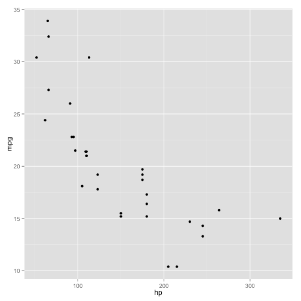
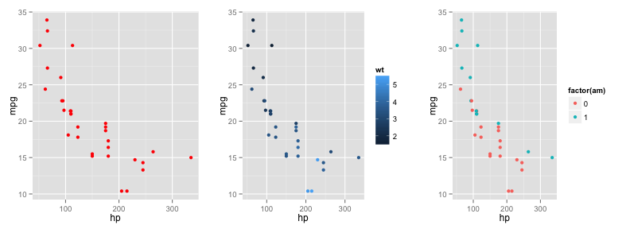
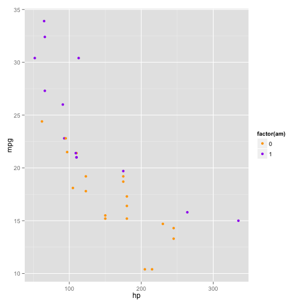
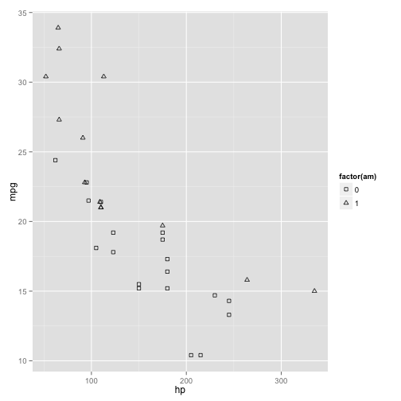
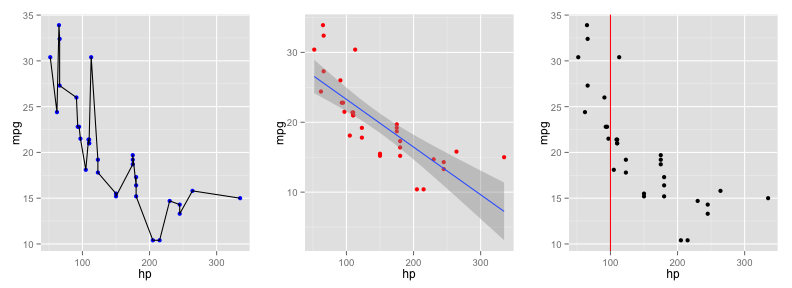
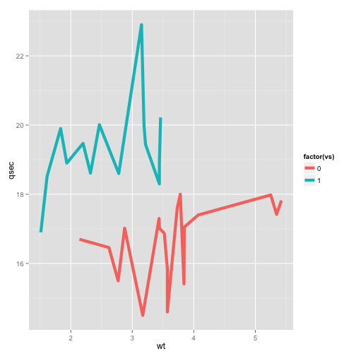
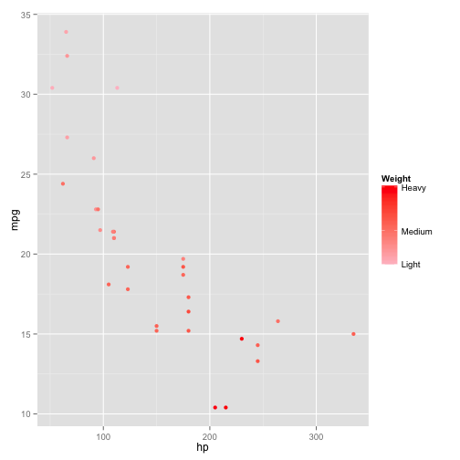

Cheetsheet for Scatterplots
========================================================
http://rforpublichealth.blogspot.com/2013/11/ggplot2-cheatsheet-for-scatterplots.html

# ggplot2: Cheatsheet for Scatterplots

The graphics package ggplot2 is powerful, aesthetically pleasing, and (after a short learning curve to understand the syntax) easy to use. I have made some pretty cool plots with it, but on the whole I find myself making a lot of the same ones, since doing something over and over again is generally how research goes. Since I constantly forget the options that I need to customize my plots, this next series of posts will serve as cheatsheets for scatterplots, barplots, and density plots. We start with scatterplots.

## Quick Intro to ggplot2

The way ggplot2 works is by layering components of your plot on top of each other. You start with the basic of the data you want your plot to include (x and y variables), and then layer on top the kind of plotting colors/symbols you want, the look of the x- and y-axes, the background color, etc. You can also easily add regression lines and summary statistics.

For great reference guides, use the ggplot2 documentation or the R Graphs Cookbook.

In this post, we focus only on scatterplots with a continuous x and continuous y. We are going to use the mtcars data that is available through R.


```r
> library(ggplot2)
> library(gridExtra)
> mtc <- mtcars
```


Here's the basic syntax of a scatterplot. We give it a dataframe, mtc, and then in the __aes()__ statement, we give it an x-variable and a y-variable to plot. I save it as a ggplot object called p1, because we are going to use this as the base and then layer everything else on top:


```r
# Basic scatterplot
p1 <- ggplot(mtc, aes(x = hp, y = mpg))
```


Now for the plot to print, we need to specify the next layer, which is how the symbols should look - do we want points or lines, what color, how big. Let's start with points:

```r
# Print plot with default points
p1 + geom_point()
```

 


That's the bare bones of it. Now we have fun with adding layers. For each of the examples, I'm going to use the __grid.arrange()__ function in the gridExtra package to create multiple graphs in one panel to save space.

## Change color of points

We start with options for colors just by adding how we want to color our points in the geom_point() layer:

```r
p2 <- p1 + geom_point(color = "red")  #set one color for all points
p3 <- p1 + geom_point(aes(color = wt))  #set color scale by a continuous variable
p4 <- p1 + geom_point(aes(color = factor(am)))  #set color scale by a factor variable

grid.arrange(p2, p3, p4, nrow = 1)
```

 


We can also change the default colors that are given by ggplot2 like this:

```r
# Change default colors in color scale
p1 + geom_point(aes(color = factor(am))) + scale_color_manual(values = c("orange", 
    "purple"))
```

 


## Change shape or size of points
We're sticking with the basic p1 plot, but now changing the shape and size of the points:

```r
p2 <- p1 + geom_point(size = 5)  #increase all points to size 5
p3 <- p1 + geom_point(aes(size = wt))  #set point size by continuous variable
p4 <- p1 + geom_point(aes(shape = factor(am)))  #set point shape by factor variable    

grid.arrange(p2, p3, p4, nrow = 1)
```

 


Again, if we want to change the default shapes we can:


```r
p1 + geom_point(aes(shape = factor(am))) + scale_shape_manual(values = c(0, 
    2))
```

 

* More options for color and shape manual changes are here
* All shape and line types can be found here: http://www.cookbook-r.com/Graphs/Shapes_and_line_types


## Add lines to scatterplot


```r
p2 <- p1 + geom_point(color = "blue") + geom_line()  #connect points with line
p3 <- p1 + geom_point(color = "red") + geom_smooth(method = "lm", se = TRUE)  #add regression line
p4 <- p1 + geom_point() + geom_vline(xintercept = 100, color = "red")  #add vertical line

grid.arrange(p2, p3, p4, nrow = 1)
```

 


You can also take out the points, and just create a line plot, and change size and color as before:

```r
ggplot(mtc, aes(x = wt, y = qsec)) + geom_line(size = 2, aes(color = factor(vs)))
```

 

* More help on scatterplots can be found here: http://www.cookbook-r.com/Graphs/Scatterplots_(ggplot2)

## Change axis labels

There are a few ways to do this. 
* If you only want to quickly add labels you can use the labs() layer. 
* If you want to change the font size and style of the label, then you need to use the theme() layer. More on this at the end of this post. 
* If you want to change around the limits of the axis, and exactly where the breaks are, you use the scale_x_continuous (and scale_y_continuous for the y-axis).

```r
p2 <- ggplot(mtc, aes(x = hp, y = mpg)) + geom_point()
p3 <- p2 + labs(x = "Horsepower", y = "Miles per Gallon")  #label all axes at once
p4 <- p2 + theme(axis.title.x = element_text(face = "bold", size = 20)) + labs(x = "Horsepower")  #label and change font size
p5 <- p2 + scale_x_continuous("Horsepower", limits = c(0, 400), breaks = seq(0, 
    400, 50))  #adjust axis limits and breaks
grid.arrange(p3, p4, p5, nrow = 1)
```

 

* More axis options can be found here: http://www.cookbook-r.com/Graphs/Axes_(ggplot2)

# Change legend options
We start off by creating a new ggplot base object, g1, which colors the points by a factor variable. Then we show three basic options to modify the legend.

```r
g1<-ggplot(mtc, aes(x = hp, y = mpg)) + geom_point(aes(color=factor(vs)))

g2 <- g1 + theme(legend.position=c(1,1),legend.justification=c(1,1))        #move legend inside                
g3 <- g1 + theme(legend.position = "bottom")                                #move legend bottom         
g4 <- g1 + scale_color_discrete(name ="Engine", 
                                labels=c("V-engine", "Straight engine"))    #change labels
grid.arrange(g2, g3, g4, nrow=1)
```

 

If we had changed the shape of the points, we would __use scale_shape_discrete()__ with the same options. We can also remove the entire legend altogether by using __theme(legend.position=“none”)__

Next we customize a legend when the scale is continuous:

```r
g5<-ggplot(mtc, aes(x = hp, y = mpg)) + geom_point(size=2, aes(color = wt))
g5 + scale_color_continuous(name="Weight",                                     #name of legend
                            breaks = with(mtc, c(min(wt), mean(wt), max(wt))), #choose breaks of variable
                            labels = c("Light", "Medium", "Heavy"),            #label
                            low = "pink",                                      #color of lowest value
                            high = "red")                                      #color of highest value
```

 

* More legend options can be found here: http://www.cookbook-r.com/Graphs/Legends_(ggplot2)

## Change background color and style

The look of the plot in terms of the background colors and style is the theme(). I personally don't like the look of the default gray so here are some quick ways to change it. I often the theme_bw() layer, which gets rid of the gray.

* All of the theme options can be found here{http://rforpublichealth.blogspot.com/2013/11/ggplot2-cheatsheet-for-scatterplots.html}.

```r
g2<- ggplot(mtc, aes(x = hp, y = mpg)) + geom_point()

#Completely clear all lines except axis lines and make background white
t1<-theme(                              
  plot.background = element_blank(), 
  panel.grid.major = element_blank(), 
  panel.grid.minor = element_blank(), 
  panel.border = element_blank(), 
  panel.background = element_blank(),
  axis.line = element_line(size=.4)
)

#Use theme to change axis label style
t2<-theme(                              
  axis.title.x = element_text(face="bold", color="black", size=10),
  axis.title.y = element_text(face="bold", color="black", size=10),
  plot.title = element_text(face="bold", color = "black", size=12)
)

g3 <- g2 + t1
g4 <- g2 + theme_bw()
g5 <- g2 + theme_bw() + t2 + labs(x="Horsepower", y = "Miles per Gallon", title= "MPG vs Horsepower")

grid.arrange(g2, g3, g4, g5, nrow=1)
```

 


## Put it all together
Finally, here's a nice graph using a combination of options:

```r
g2<- ggplot(mtc, aes(x = hp, y = mpg)) + 
  geom_point(size=2, aes(color=factor(vs), shape=factor(vs))) +
  geom_smooth(aes(color=factor(vs)),method = "lm", se = TRUE) +
  scale_color_manual(name ="Engine", 
                     labels=c("V-engine", "Straight engine"),
                     values=c("red","blue")) +
  scale_shape_manual(name ="Engine", 
                     labels=c("V-engine", "Straight engine"),
                     values=c(0,2)) +
  theme_bw() + 
  theme(                              
    axis.title.x = element_text(face="bold", color="black", size=12),
    axis.title.y = element_text(face="bold", color="black", size=12),
    plot.title = element_text(face="bold", color = "black", size=12),
    legend.position=c(1,1),
    legend.justification=c(1,1)) +
  labs(x="Horsepower", 
       y = "Miles per Gallon", 
       title= "Linear Regression (95% CI) of MPG vs Horsepower by Engine type")

g2
```

 


